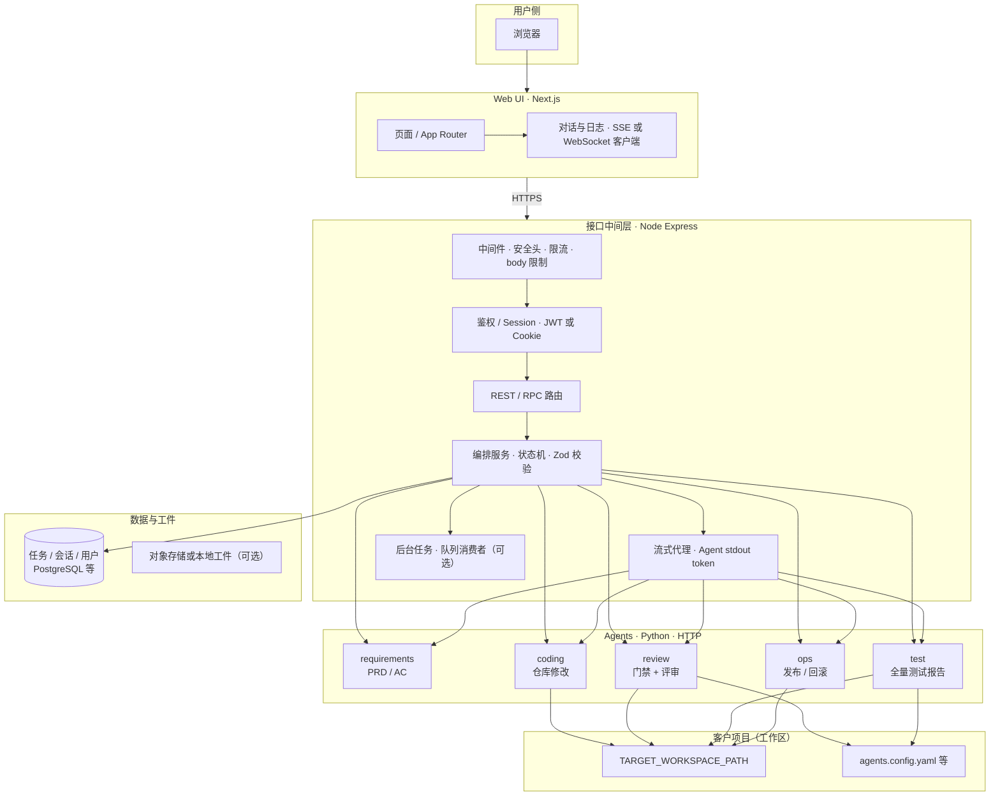
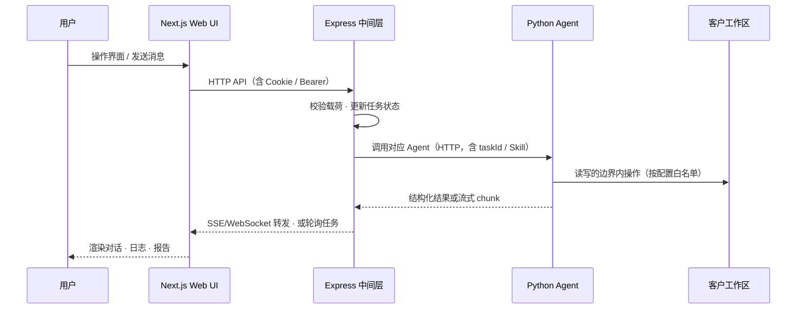
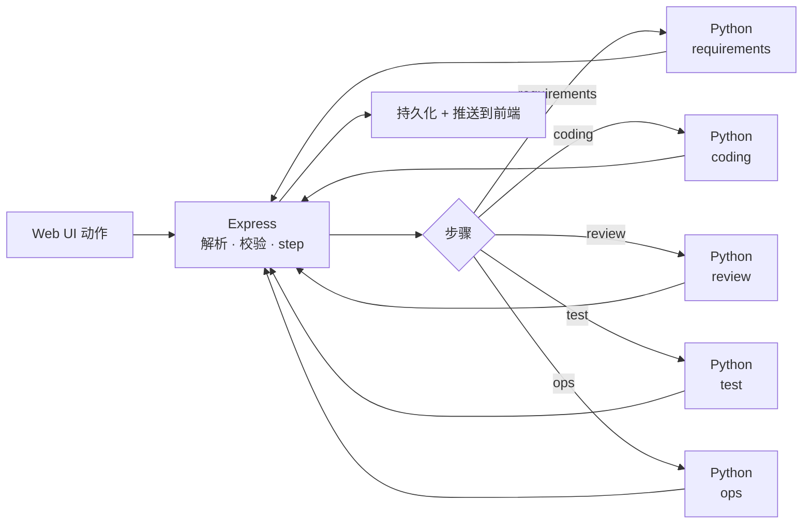
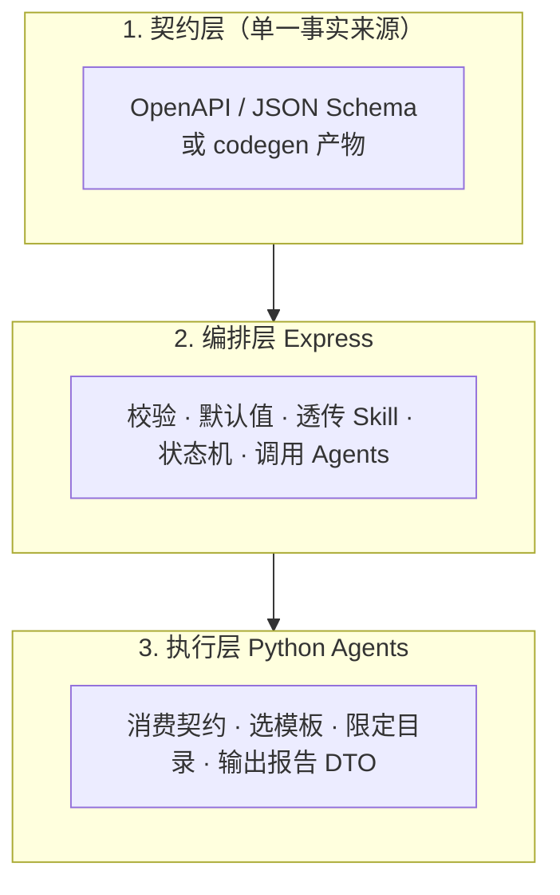
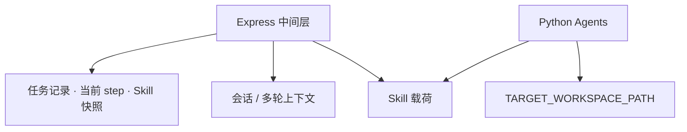

# agents-monorepo（软件研发智能群体）

本仓采用 **全新三层架构**（不接入飞书）：

| 层级 | 技术 | 职责 |
|------|------|------|
| **Web UI** | **Next.js** | 在本项目内完成所有操作：对话、任务与流水线视图、配置、日志与结果展示 |
| **接口 / 中间层** | **Node.js + Express** | 鉴权、会话与任务编排、请求校验、调用 Python Agents、流式响应聚合、与存储/队列交互 |
| **Agents** | **Python（[uv](https://github.com/astral-sh/uv)）** | 需求分析、编码、审核、测试、运维等 **独立 HTTP 服务**（或 Worker），由中间层按步骤调度；依赖与虚拟环境由 **uv** 管理 |

共享的 **步骤类型、任务 DTO、运行时 Skill** 等契约，建议在仓库内以 **OpenAPI / JSON Schema**（或等效单一源码）描述，由 Node 与 Python 共同遵循，避免双端各写一套枚举。

> **目录形态**：落地时可采用例如 `apps/web`（Next）、`apps/api`（Express）、`agents/*`（各 Agent 目录内 **`pyproject.toml` + `uv.lock`**）；下文以逻辑名称为准，与实际文件夹名可对齐调整。

### pnpm + uv 混合 monorepo

- **pnpm**：管理 Next、Express 与 TS 共享包（`pnpm-workspace.yaml`、`pnpm-lock.yaml`）。  
- **uv**：管理全部 Python Agent（每个服务一个项目，或仓库根一个 **uv workspace** 统揽多个 `agents/*` 子包）。  
- **关系**：同属一个 Git 仓库；**不要求** 把 Python 放进 `package.json`。根目录可用脚本把两端串起来，例如 `"dev:agents": "uv run --directory agents/coding python -m coding.cli"`，或在 Turborepo 里为 Python 任务单独配置 `outputs` / `cache`。  
- **锁文件**：Node 与 Python 各一把锁（`pnpm-lock.yaml` + 各 `uv.lock`），CI 中同时安装两者即可。

---

## 文档与约定

| 资源 | 说明 |
|------|------|
| `docs/ARCHITECTURE.md` | 建议维护：HTTP 契约、步骤机、Skill 字段表、部署拓扑（若尚未创建，可与本 README 同步演进） |
| `.cursor/rules/project-conventions.mdc` | Monorepo 通用约定（密钥不进库、类型与测试习惯等） |
| `.cursor/rules/env-secrets.mdc` | 环境变量与密钥 |

---

## 总体架构图（逻辑视图）

---

## 端到端功能流程图（主流水线）

步骤型流水线（与具体 UI 无关的逻辑）可概括为：

---

## 运行时 Skill 分层（跨语言）

**Skill**：编排时注入的任务上下文（例如实现角色、栈画像、运维模式、目标栈等），**不是** Cursor 里的 `SKILL.md`。

**原则**：新增字段时先改契约；Express 负责校验与下发；Python 只认契约中的类型，避免硬编码散落字符串。

---

## 各模块功能说明

### Next.js Web UI（`apps/web` 等）

| 能力 | 说明 |
|------|------|
| 唯一操作入口 | 不依赖飞书；登录、项目/会话切换、对话、任务时间线 |
| 实时反馈 | 对接中间层 **SSE** 或 **WebSocket**，展示 Agent 流式输出与步骤日志 |
| 配置面 | 流水线参数、危险操作二次确认（见下）由 UI 显式触发，不写死口令在代码库 |
| 与 API | 同域 BFF 反代或 `NEXT_PUBLIC_API_BASE`；Cookie 需 `SameSite`/HTTPS 策略 |

---

### Express 接口中间层（`apps/api` 等）

| 能力 | 说明 |
|------|------|
| 对外 API | 面向 Next 与（可选）自动化脚本的 REST/JSON；内部 **`/internal/agents/*`** 可仅供内网 |
| 编排 | 任务状态机、步骤枚举与 **Skill** 注入；长任务用队列 + 轮询/SSE，避免阻塞 worker |
| 调用 Agents | `fetch`/`axios` 调 Python 服务；统一超时、重试策略、可观测 `taskId` |
| 安全 | **helmet**、CORS 白名单、请求体大小限制；敏感操作用户身份 + **二次确认令牌**（由配置与 DB 管理，非飞书文本口令） |
| 存储 | 用户、会话、任务、Artifact 路径；不把客户仓库密钥写入日志 |

典型目录：`src/config`、`src/routes`、`src/services`、`src/middlewares`、`src/workers`。

---

### Python Agents（`agents/*`，包管理：**uv**）

各 Agent 为 **无状态或弱状态 HTTP 服务**：接收中间层下发的 **任务载荷 + Skill + `TARGET_WORKSPACE_PATH`**，返回结构化 JSON；流式场景可用 **chunked** 或 **WebSocket** 由中间层转给前端。

**uv 约定（落地时）**：每个 Agent 目录（或 monorepo 级 workspace）维护 `pyproject.toml`；本地 `uv sync` 安装依赖，`uv run pytest` / `uv run uvicorn ...` 运行与测试；不把 `venv/` 提交进 Git，由 `uv.lock` 保证可复现构建。

| Agent | 职责概要 |
|--------|----------|
| **requirements** | 自然语言 → 结构化 PRD、验收标准、风险与待确认项 |
| **coding** | 在白名单路径与分支策略下修改客户仓库或脚手架 |
| **review** | 确定性命令（lint、类型检查等）+ 模型规则评审 → blocking / warnings |
| **test** | 执行配置中的全量测试命令，产出结构化测试报告 |
| **ops** | 发布、备份、回滚、只读巡检；仅在中间层判定前置步骤通过后允许 |

**边界**：Agent **不**直接对浏览器鉴权；**不**实现完整「产品 REST」；与中间层约定版本化 API。

---

### 共享契约（推荐）

- 仓库根或 `contracts/`：`openapi.yaml` 或 JSON Schema 目录；CI 校验 Node/Python 客户端与文档一致。
- 若保留 TypeScript 包：可放置轻量 **`packages/api-types`** 仅从 OpenAPI 生成类型；Python 侧可用相同 spec 生成 **pydantic** 模型（生成步骤作为 dev dependency，由 **`uv run`** 执行）。

---

## 数据与控制（概念图）

---

## 本地开发与自测（建议）

- **Next**：`pnpm dev`（或 turborepo 任务），检查控制台无 hydration/路由错误。
- **Express**：`pnpm dev` / `node dist/index.js`；`GET /health`；与 Agents 基址分离配置。
- **Python（uv）**：进入 Agent 目录或根 workspace 后 `uv sync`；`uv run pytest`；`uv run uvicorn module:app --host 0.0.0.0 --port <PORT>`（具体模块名以各 Agent 为准）；每个 Agent 独立端口，中间层用 env 拼装 URL。
- **联调**：docker-compose 可选（web + api + agents + db）；镜像内可用官方方式安装 **uv** 后 `uv sync --frozen`；E2E 可用 Playwright 打全链路。
- **密钥**：仅 `.env` / 密钥管理系统；见 `env-secrets.mdc`。

---

## 与旧版「飞书编排」的关系

本架构 **不再**使用飞书 Webhook 作为入口；原「orchestrator 回写飞书」替换为 **Express 写库 + Web UI 实时拉取**。若历史文档仍提飞书，以本 README 与新版 `docs/ARCHITECTURE.md` 为准。

---

## 许可证

以仓库根目录 `LICENSE` 为准（若尚未添加，由项目维护者补充）。
