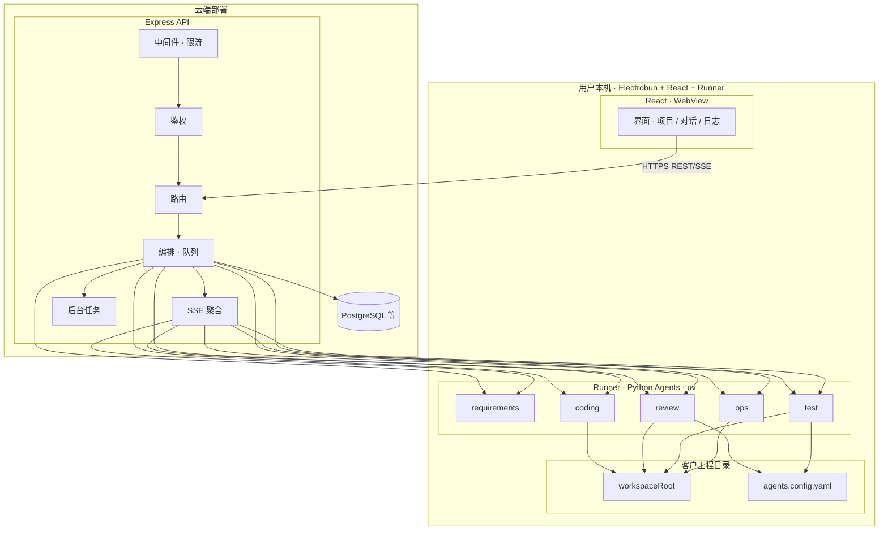
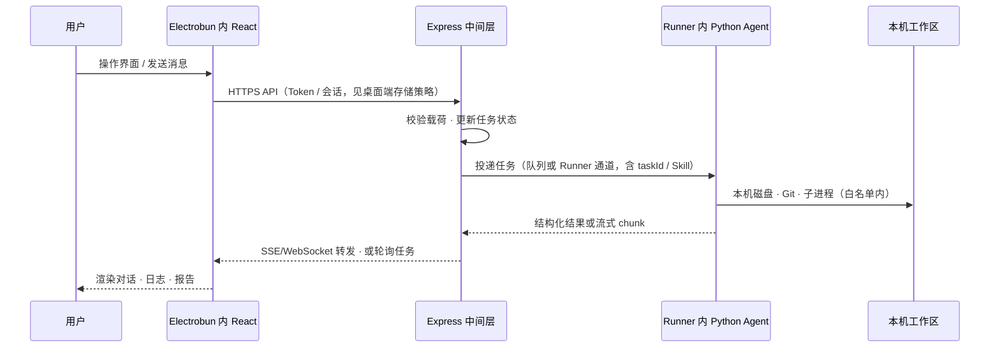
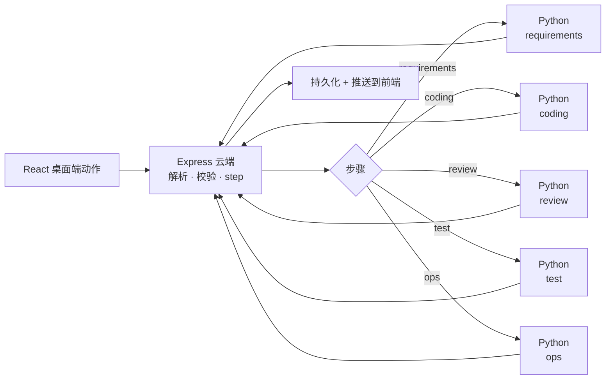
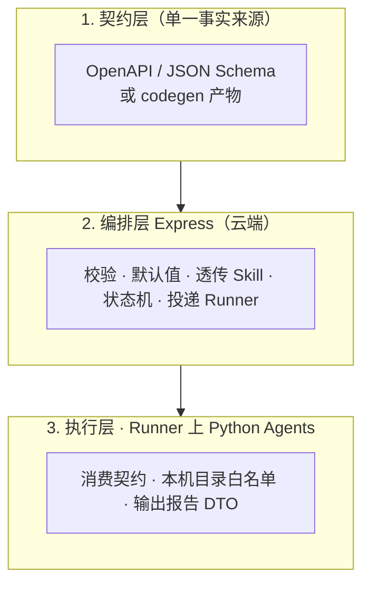
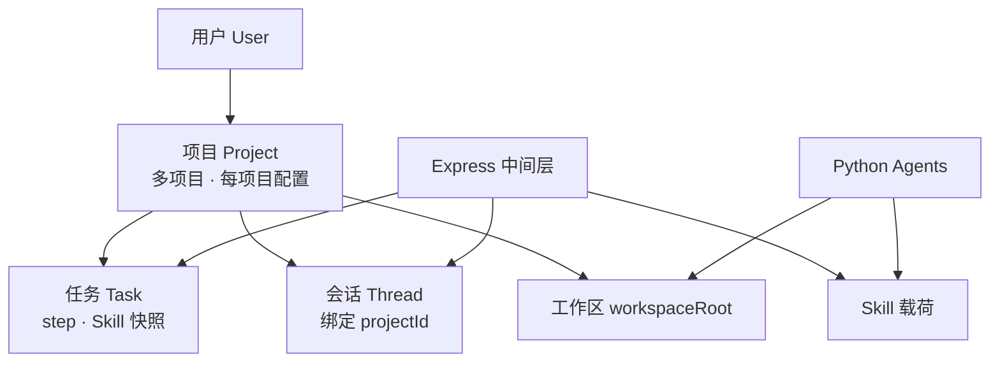

# agents-monorepo（软件研发智能群体）

本仓采用 **云端控制面 + 本机 Electrobun 桌面端** 架构（前端 **React**）：

| 层级 | 技术 | 职责 |
|------|------|------|
| **本机客户端** | **[Electrobun](https://blackboard.sh/electrobun/docs/) + React** | 打包为 **桌面应用**：多项目配置、对话与任务视图、流式日志；通过 **HTTPS** 连云端 API；与本机 **Runner（Python）** 同进程或 RPC 协作，**唯一**经授权操作 `workspaceRoot` 的入口 |
| **接口 / 中间层（部署在云端）** | **Node.js + Express** | 鉴权、多项目元数据、任务编排；**经消息队列** 投递异步任务；**不在服务器上对客户工程目录做增删改查**；将需落盘 / Git / 子进程的步骤 **发布到绑定 `runnerDeviceId` 的队列分区** |
| **Agents / Runner** | **Python（[uv](https://github.com/astral-sh/uv)）** | **跑在用户电脑上**：**消费队列（拉取/ACK）** 执行各 Agent；**周期性上报心跳** 至云端以标记在线；服务器 **无** 客户仓写权限；依赖由本机 **uv** 管理 |

共享的 **步骤类型、任务 DTO、运行时 Skill** 等契约，建议在仓库内以 **OpenAPI / JSON Schema**（或等效单一源码）描述，由 Node 与 Python 共同遵循，避免双端各写一套枚举。

> **目录形态**：例如 `apps/desktop`（**Electrobun + React**）、`apps/api`（Express，云端）、`agents/*`（Runner 内 Python，各目录 **`pyproject.toml` + `uv.lock`**）；下文以逻辑名称为准，可对齐调整。

### pnpm + uv 混合 monorepo

- **pnpm**：管理 React 桌面壳（Electrobun 工程）、Express 与 TS 共享包（`pnpm-workspace.yaml`、`pnpm-lock.yaml`）；Electrobun 主体依赖 **Bun** 运行时，与 pnpm 并存时以各子包 README 为准。  
- **uv**：管理全部 Python Agent（每个服务一个项目，或仓库根一个 **uv workspace** 统揽多个 `agents/*` 子包）。  
- **关系**：同属一个 Git 仓库；**不要求** 把 Python 放进 `package.json`。根目录可用脚本把两端串起来，例如 `"dev:agents": "uv run --directory agents/coding python -m coding.cli"`，或在 Turborepo 里为 Python 任务单独配置 `outputs` / `cache`。  
- **锁文件**：Node 与 Python 各一把锁（`pnpm-lock.yaml` + 各 `uv.lock`），CI 中同时安装两者即可。

### 必选基础设施：消息队列与 Runner 心跳

两者均为 **架构必选**，不是可选优化项。

| 组件 | 部署位置 | 作用 |
|------|----------|------|
| **消息队列** | **云端**（与 Express 同 VPC 或托管服务） | **削峰、异步、可靠投递**：Express 只做「校验 + 入队 + 更新任务状态」；Runner **拉取 / 订阅并 ACK** 任务，避免同步 HTTP 阻塞与易丢消息；支持 **按 `runnerDeviceId` / `projectId` 分区**，防止错投；**DLQ、可见性超时、幂等键** 在 `docs/ARCHITECTURE.md` 定稿（技术选型如 Redis Streams、RabbitMQ、NATS、SQS 等）。 |
| **Runner 心跳** | **本机 Runner → 云端 API** | **在线状态真源**：周期性上报（或 WebSocket 保活），载荷含 `runnerDeviceId`、`userId`、Runner/契约版本、可选已挂载 `projectId` 摘要；云端维护 **`lastSeenAt`**，用于 **仅向在线 Runner 派发可写盘任务**、桌面/飞书侧展示「设备离线」及告警。**间隔、超时判定（如连续 N 周期未收到即离线）** 写入 `docs/ARCHITECTURE.md`。 |

**关系简述**：写盘类步骤 **先入队**；调度或消费前校验 **目标 Runner 心跳仍有效**，否则 **延迟入队或返回明确失败**，与飞书移动端门禁一致。

---

## 文档与约定

| 资源 | 说明 |
|------|------|
| `docs/ARCHITECTURE.md` | 建议维护：HTTP 契约、步骤机、Skill、**消息队列分区与消费语义**、**Runner 心跳字段与超时策略**、部署拓扑 |
| `docs/FEISHU_COMMANDS.md` | **（后续规划）** 飞书指令词与内部 `action` 映射；v1 可仅占位 |
| `.cursor/rules/project-conventions.mdc` | Monorepo 通用约定（密钥不进库、类型与测试习惯等） |
| `.cursor/rules/env-secrets.mdc` | 环境变量与密钥 |

---

## 用户与多项目、工作区形态（业务域）

平台面向 **真实工程目录**：可能是 **尚未 `git init` 的新目录**、**仅有本地的 Git 仓**，或 **已对接远端的存量老项目**。同时，**按登录用户做隔离**，**一人可配置多个项目**；所有编排与 Agent 执行都必须落在 **明确的项目作用域** 内，避免串项目、串上下文。

### 多项目（按用户隔离）

- 一个 **用户**（账号）可创建并维护 **多个「项目」**（Product 可称 Workspace / Project，下文统称 **项目**）。
- 每个项目存 **独立配置**（建议落 DB，大文件可走对象存储 + 版本），至少包括：
  - **工作区根路径** `workspaceRoot`：登记在 **本机 Runner** 上的绝对路径（即 **`TARGET_WORKSPACE_PATH` 仅在用户电脑上的 Runner 进程内解析**）。**服务器不保存客户源码副本、不在 VPS 上挂载该路径做读写**（见 **「远程部署与本机桌面」**）。
  - **Git 元数据**：是否已初始化、默认分支、远端 URL（可选）、克隆/拉取策略（与凭证管理方式一起在 `docs/ARCHITECTURE.md` 写清）。
  - **流水线与客户规则**：如 `agents.config.yaml` 的内容或路径、`stackProfile`、lint/test 命令覆盖等。
- **所有 HTTP API 与异步任务** 必须携带 **`userId` + `projectId`（或向后兼容的等效作用域）**；Express **校验该项目属于当前用户** 后才允许读配置、入队、调 Python。**禁止**仅凭客户端传来的任意路径执行，避免越权。

### 新项目、无 Git 与老项目

| 形态 | 说明 | 产品 / 编排建议 |
|------|------|------------------|
| **新目录、尚无 Git** | 空目录或脚手架文件 | **React 桌面端**引导 + 用户确认后，由 **Runner** 执行 `git init`、首交、`remote add`；**凭证仅在用户本机或系统密钥链**，不入业务库明文 |
| **本地 Git、暂无远端** | 已 init / 有提交 | 可先只绑定路径；后续再配 `remote` 与同步策略 |
| **老项目 / 已有远端** | 克隆下来的仓或长期维护仓 | 记录默认分支与拉取策略；Review/Test **与客户仓现有脚本对齐**；路径与白名单以 **该项目配置** 为准 |

同一用户下 **不同项目默认不共享磁盘根路径**；若业务上允许「多项目指向同一路径」，须在 UI 与审计上 **强提示风险**，并仍用 **多条 project 记录** 区分配置与任务，避免任务写错命名空间。

### Runner、安全与并发

- **执行点**：对客户目录的 **任何列出/读取/写入/删除文件、执行 git、跑测试与 lint**，只发生在 **已注册且授权该 `workspaceRoot` 的 Runner** 内；Express 只校验 **`userId` + `projectId` + Runner 设备** 后 **派发任务**，不尝试在服务器磁盘上打开客户路径。
- **路径约束**：Runner 内 Agent 只接受 **该项目已登记的允许根目录**；实际访问路径应 **约束在该根之下**（规范化后比较），防止 `../` 逃逸。
- **多项目并发**：全局限流之外，可对 **`userId` / `projectId`（或每用户总并行任务数）** 设配额，避免单用户多开项目占满 Worker。
- **上下文归属**：多轮对话与任务时间线建议 **绑定 `projectId`（及 threadId）**，用户切换当前项目时 **不混用** 另一项目的会话摘要。

---

## 远程部署与本机桌面（Electrobun + React）（必读）

### 既定方案：云服务器 + 本地 Electrobun

**控制面在云端**：Express、数据库、队列、账号与项目元数据部署在 **云服务器**；用户通过 **安装在本机的 Electrobun 桌面应用**（界面为 **React**）登录并操作。

**执行面在用户电脑**：客户工程目录的 **增删改查、Git、本地跑测试/lint** 全部在 **本机 Runner（Python + uv）** 完成；Electrobun 主进程可负责 **拉起 Runner、RPC、系统托盘、自动更新** 等与操作系统相关的职责。服务器 **不** `clone` 用户私有仓在 VPS 上做日常 Coding，也 **不** 挂载用户的 `workspaceRoot`。

### 硬性约束（与服务器职责边界）

与上一致：**任意客户仓库落盘修改只发生在用户机器**；云端仅存 **任务状态、配置、可选附件元数据** 等。

### 为何选用 Electrobun + React

| 点 | 说明 |
|----|------|
| **超越纯浏览器** | 纯 Web 无法可靠、完整地操作本机目录；桌面壳可稳定绑定 **Runner** 与 **`workspaceRoot`**。 |
| **与云端解耦** | React 仅把云端当作 **API / SSE 端点**（如 `VITE_*`、`import.meta.env` 或构建时注入 `PUBLIC_API_BASE`）；**静态资源也可只随安装包分发**，不必把 UI 托管在业务 VPS 上。 |
| **体量与更新** | Electrobun 面向小型原生壳 + WebView；适合「轻安装包 + 连公网 API」模式（具体版本与能力以 [Electrobun 文档](https://blackboard.sh/electrobun/docs/) 为准）。 |

### 其它拓扑（非本仓库默认）

| 方案 | 说明 |
|------|------|
| **自托管一体机** | Web/API/Runner 同机；适合内网，**不是**「云 SaaS + 千家万户本机仓」的主线。 |
| **仅浏览器** | File System Access 等 **不能**替代 Runner；不作产品主路径。 |

**不适用**：在 **平台服务器** 上维护用户仓 **可写副本** 并让 Agent 在机房内日常改代码。云端 **用户显式上传** 的附件与报告可与 Runner 侧权威工程目录并存，但 **不替代** 本机工程。

### 与本项目其它章节的关系

- **多项目**：`projectId` 绑定 **Runner 设备 id + 本机 `workspaceRoot`**（登记用于校验，真实 IO 仅在 Runner）。  
- **安全**：Runner **注册、吊销、每项目根目录授权**；日志带 **`projectId`、runnerDeviceId**。  
- **高并发**：任务载荷带 **目标 Runner**；多设备时 **按设备队列** 分区，避免误派发。

### 建议在 `docs/ARCHITECTURE.md` 中固定

- 数据面：**哪些 API 仅写 DB**、**哪些步骤必须到达 Runner**。  
- 交付 **Electrobun 安装包构建、自动更新（若启用）、Runner 随包或首次向导安装**；以及 **Runner 心跳、吊销** 说明。  
- 若存在仅此内网工具场景要在服务端碰盘，须 **单独安全审计**，不作为默认产品路径。

---

## 总体架构图（逻辑视图）

**图示**：`reactui` 与 `agentsLayer` 同属 **本机**；Express 仅在 **云端** 编排并入队，**任务执行与磁盘 IO** 只在 Runner 内完成；`workspaceRoot` **永不** 挂载到业务 VPS。

## 端到端功能流程图（主流水线）

步骤型流水线（与具体 UI 无关的逻辑）可概括为：

---

## 运行时 Skill 分层（跨语言）

**Skill**：编排时注入的任务上下文（例如实现角色、栈画像、运维模式、目标栈等），**不是** Cursor 里的 `SKILL.md`。

**原则**：新增字段时先改契约；Express 负责校验与下发；Python 只认契约中的类型，避免硬编码散落字符串。

---

## 各模块功能说明

### 本地客户端：Electrobun + React（`apps/desktop` 等）

基于 [Electrobun](https://blackboard.sh/electrobun/docs/)：**Bun** 侧主进程 + **系统 WebView** 渲染 **React**。职责如下。

| 能力 | 说明 |
|------|------|
| 唯一操作入口（产品侧） | 登录、**当前项目切换**、多项目配置、对话、任务时间线；安装包分发与版本更新可走 Electrobun 自带或自建通道 |
| 与云端 API | `PUBLIC_API_BASE` / `VITE_*` / `import.meta.env` 等 **构建期或首次启动配置**，指向 **云服务器上的 Express**；**HTTPS**、证书校验按发布环境配置 |
| 与本机 Runner | **同机** 启动/守护 Python Runner，或通过 **Electrobun RPC** 把「选定的根目录、环境变量」交给子进程；**不在桌面里硬编码密钥** |
| 实时反馈 | **SSE / WebSocket** 连云端，或由 Runner **回传** 经本地桥接展示流式日志（具体桥接在实现期定一种主路径） |
| 安全 | 危险操作二次确认、Token 仅存 **本机安全存储**（由 Electrobun/OS 能力选型），不写死口令进仓库 |

---

### Express 接口中间层（`apps/api` 等）

| 能力 | 说明 |
|------|------|
| 对外 API | 面向 **Electrobun 桌面端内嵌的 React** 与（可选）自动化脚本的 REST/JSON；内部 **`/internal/*`** 可仅供内网 |
| 编排 | 任务状态机、步骤枚举与 **Skill** 注入；长任务用队列 + 轮询/SSE，避免阻塞 worker |
| 调用 Agents / Runner | 将 **需触碰客户磁盘的步骤** **投递至绑定的 Runner**（队列、设备路由）；Express **自身**不对 `workspaceRoot` 做 IO；可另有无状态轻任务留在服务端（仅以 DB/远程 API 为界） |
| 安全 | **helmet**、CORS 白名单、请求体大小限制；敏感操作用户身份 + **二次确认令牌**（服务端签发与校验，**不落明文**到日志与响应） |
| 存储 | 用户、**项目（每用户多项目）**、会话、任务、Artifact 路径；**每条记录带 `userId` + `projectId` 作用域**；不把客户仓库密钥写入日志 |

典型目录：`src/config`、`src/routes`、`src/services`、`src/middlewares`、`src/workers`。

---

### Python Agents（`agents/*`，包管理：**uv**）

各 Agent **运行在用户侧 Runner**，与 Express 之间为 **任务投递与回调**（如队列 + Runner 拉取、或 Runner 对控制面暴露的受控 HTTP）；须 **拒绝** 任何未与 **`userId` + `projectId` + 已登记 Runner** 绑定的裸路径。返回结构化 JSON；流式可由 Runner **回传** 至 Express 再转前端。

**uv 约定（落地时）**：每个 Agent 目录（或 monorepo 级 workspace）维护 `pyproject.toml`；本地 `uv sync` 安装依赖，`uv run pytest` / `uv run uvicorn ...` 运行与测试；不把 `venv/` 提交进 Git，由 `uv.lock` 保证可复现构建。

| Agent | 职责概要 |
|--------|----------|
| **requirements** | 自然语言 → 结构化 PRD、验收标准、风险与待确认项 |
| **coding** | 在白名单路径与分支策略下修改客户仓库或脚手架 |
| **review** | 确定性命令（lint、类型检查等）+ 模型规则评审 → blocking / warnings |
| **test** | 执行配置中的全量测试命令，产出结构化测试报告 |
| **ops** | 发布、备份、回滚、只读巡检；仅在中间层判定前置步骤通过后允许 |

**边界**：Agent **仅**认 **Runner 进程** 与约定载荷；**不**对 **除云端编排通道外的裸 HTTP** 开放等价于「产品 REST」的写盘能力；与中间层约定版本化 API。

---

### 共享契约（推荐）

- 仓库根或 `contracts/`：`openapi.yaml` 或 JSON Schema 目录；CI 校验 Node/Python 客户端与文档一致。
- 若保留 TypeScript 包：可放置轻量 **`packages/api-types`** 仅从 OpenAPI 生成类型；Python 侧可用相同 spec 生成 **pydantic** 模型（生成步骤作为 dev dependency，由 **`uv run`** 执行）。

---

## 可预见坑点与对策（不合理之处与优化方案）

以下为落地前即可预判的问题：**左列为风险或反模式，右列为推荐做法**。实施时把关键项写进 `docs/ARCHITECTURE.md` 或 ADR，避免口头约定。

### 契约、版本与 CI

| 坑点 / 不合理之处 | 优化方案 |
|-------------------|----------|
| Node 与 Python 各写一套 DTO / 枚举，字段悄悄不一致 | **OpenAPI 或 JSON Schema 作为单一事实来源**；TS 类型与 Python 模型由生成或 CI **diff 校验**保证同步 |
| 中间层已发新 Skill 字段，部分 Agent 未升级，静默丢字段或解析错误 | 任务载荷带 **`skillSchemaVersion` / `apiVersion`**；中间层按版本路由；旧 Worker **显式拒绝或降级策略**，禁止「半升级」 |
| Review / Test Agent 跑的命令与客户 **真实 CI** 不一致，出现「Agent 通过、流水线失败」 | **与客户仓同源配置**：从 `agents.config.yaml` 或仓库约定路径读 `lint` / `fullTestCommand`；文档写明 **以何者为准** |

### 运行时模型与可观测

| 坑点 / 不合理之处 | 优化方案 |
|-------------------|----------|
| 长任务（全量测试、发布）同步阻塞 Express，连接超时、难扩容 | **短 HTTP 仅负责入队 + 返回 `taskId`**；Worker 执行；状态 **queued / running / succeeded / failed** 持久化；前端 **SSE 或轮询** |
| 多路流式（模型 token、子进程日志、步骤心跳）各走各的协议，前端与排障困难 | **中间层汇聚为统一 SSE/WebSocket 事件**（含 `runId`、`step`、`source`）；前端只对接一套协议 |
| React 桌面端 → Express → Python Runner → 本机仓 → 外部模型，排障无串点 | 全链 **`X-Request-Id` / `traceId`**；结构化日志带 **`runnerDeviceId`**；可选 **OpenTelemetry** |

### Agent 拓扑与安全

| 坑点 / 不合理之处 | 优化方案 |
|-------------------|----------|
| 每个 Agent 一个 HTTP 服务，端口与部署矩阵爆炸，团队小时运维成本高 | 早期可 **减少进程数**（单机多路由的 Python 网关、或队列 + 单类 worker）；若坚持微服务，必备 **健康检查、版本清单、统一配置基址** |
| Coding Agent **任意 shell / 开放网络**，误用或滥用时攻击面大 | **能力白名单**：写路径、分支、受控工具 API；敏感操作需中间层 **二次确认 + 权限**；禁止默认「全机 exec」 |
| 多轮对话只靠模型记忆，无会话真源 | **会话与任务快照以 DB 为准**；Agent 仅带摘要与 `taskId`；避免无状态 HTTP 导致上下文碎裂 |

### 产品与编排

| 坑点 / 不合理之处 | 优化方案 |
|-------------------|----------|
| 危险操作（发布、改全局规则）仅靠「信任操作者」 | Web **显式二次确认** + 服务端 **一次性 token**；**审计日志**（谁、何时、对哪一 `taskId`、何种动作） |
| 阶段越多，状态机越难维护，一味全自动易把错需求推到生产 | **可配置人工闸门**（如 PRD 确认、发布前确认）；失败与重试策略在编排层统一，避免每 Agent 自建一套 |
| **uv** 在 `agents/*` 里一半独立项目、一半 workspace，新人无从下手 | **立项时定一种**：「根 uv workspace 统管多包」或「每 Agent 独立 `pyproject.toml`」；README/脚手架只推一种 **黄金路径** |
| 一人多项目但请求 **不带 `projectId`**，会话与工作区串台 | 所有写操作与长连接 **强制作用域**（`userId` + `projectId`）；`workspaceRoot` 仅在对照 DB 与 **Runner 设备** 后下发任务；日志带 **`projectId`** |
| **服务已上云**，仍假设用 **纯浏览器页** 即可由服务器直接读写用户工程 | **禁止**：产品形态为 **Electrobun + Runner**；服务器只编排，**不** 碰客户盘（见 **「远程部署与本机桌面」**） |

### 小结（优先级建议）

1. **契约 + CI 校验**（防双端漂移）  
2. **异步任务 + 统一流式**（防阻塞与观测混乱）  
3. **traceId + 结构化日志**（防跨语言排障地狱）  
4. **同源测试/门禁命令 + Skill 版本**（防「绿了但 CI 红」与半升级）  
5. **DB 会话/任务 + 危险操作审计**（防责任不可追溯与状态黑洞）  
6. **无状态 API + 消息队列 + Runner 心跳 + 可扩展消费端**（见上文「必选基础设施」及「高并发」）  
7. **全服务统一 JSON 日志字段与脱敏策略**（见下文「清晰日志」）  
8. **客户工程不落服务器盘**：文件类步骤 **只** 由 **Runner** 完成；标配客户端为 **Electrobun + React**（见 **「远程部署与本机桌面」**）

---

## 高并发方案（设计约定）

**目标**：入口扛突发；**消息队列** 削峰且可靠投递；**Runner 心跳** 保证任务不长期积压在离线设备；扩容尽量不动业务分支逻辑。队列承担 **削峰与可靠投递**，心跳承担 **可调度性**。

### 消息队列（与必选基础设施对齐）

- **生产**：Express 在校验 `userId` / `projectId` /（写盘类）**Runner 在线** 后 **发布消息**；消息体含 `taskId`、`traceId`、步骤类型、`skillSchemaVersion`、目标 `runnerDeviceId` 等。  
- **消费**：Runner 内 **单消费者或多 worker 进程** 从 **专属分区或 routing key** 拉取；**ACK/NACK**、重试与 **DLQ** 行为与业务幂等键一起在 `docs/ARCHITECTURE.md` 写明。  
- **多 Runner / 多项目**：按设备与项目 **隔离队列或 key**，避免 A 用户任务被 B 用户 Runner 拉取。

### 架构分层（补充）

| 层级 | 高并发要点 |
|------|------------|
| **React · Electrobun 桌面** | **静态资源可随安装包**；首屏与升级走自建 CDN 可选；重计算在 **Runner** 或 Worker，勿阻塞 WebView 主线程 |
| **Express** | **无状态**：会话与用户上下文放 **Redis / DB**，实例间可水平扩容；HTTP 层只做校验、入队、读状态，**长作业不占着连接** |
| **队列** | **削峰**：任务写入 **Redis Stream / RabbitMQ / SQS** 等（选型写入 `docs/ARCHITECTURE.md`）；队列深度与消费延迟做监控与告警 |
| **Worker** | 服务端消费者仅处理 **不写客户盘** 的工作（通知、聚合、对外 API）；**跑 lint/test/写文件** 的 worker **在 Runner 侧**；并发度与 Runner 机器资源、每 `projectId` 配额联动 |
| **数据库** | **连接池**上限与实例数匹配；避免「一请求一长事务」；热点行（同一 `taskId` 更新）考虑乐观锁或顺序队列 |

### 请求与任务语义

- **限流**：对 **用户 / IP / API Key** 分层限流；对创建任务、触发 LLM 等昂贵接口单独配额。  
- **幂等**：同一业务键（如 `clientMutationId`、`taskId` + `action`）重复提交不产生重复副作用。  
- **背压**：队列过长时 **快速失败**（429/503 + 明确文案）或延迟入队，避免内存与 DB 无限堆积。  
- **SSE / WebSocket**：长连接在网关或专用层统计连接数、空闲超时；必要时分 **读连接** 与 **写 API** 扩缩。  
- **Python HTTP**：若多进程，注意 **文件描述符与子进程**（lint/test）资源；重型命令用 **独立 worker 池** 或队列隔离，避免占满 API 进程。

### 与「可预见坑点」的衔接

长任务 **必须** 走「入队 + 异步执行」（见上表「运行时模型」），这是高并发的 **前置条件**；仅靠调大 `uvicorn --workers` 无法解决同步阻塞编排的问题。

---

## 清晰日志方案（设计约定）

目标：任何人用 **同一套查询方式**（`traceId`、`taskId`、时间窗）即可串起 **桌面端 → Express → 队列 → Runner → 子进程**，且 **生产日志可读、可聚合、不泄露密钥**。

### 统一结构化字段（建议最小集合）

| 字段 | 说明 |
|------|------|
| `timestamp` | ISO8601 / Unix ms，**UTC** 推荐 |
| `level` | `error` / `warn` / `info` / `debug`（生产默认 `info`，Debug 可抽样） |
| `service` | 固定服务名，如 `web`、`api`、`agent-coding`、`worker` |
| `env` | `development` / `staging` / `production` |
| `traceId` | **全链路透传**（HTTP Header，如 `X-Request-Id`，缺失则入口生成） |
| `taskId` / `runId` | 编排任务与单次运行标识，便于与 DB 状态对照 |
| `projectId` | **项目作用域**（一人多项目时排障与配额必选） |
| `runnerDeviceId` | **Runner 实例**（心跳、队列消费、多机排障） |
| `userId` | 仅存内部 id 或 **哈希**，避免可直接识别 PII |
| `msg` / `message` | 简短人类可读说明 |
| `err` | 错误时：`name`、`message`、**脱敏后的** `stack`（可选，按环境） |
| `extra` / `context` | 结构化附加键值（**禁止**在此放 token、Cookie、仓库 URL 中的凭据） |

Node 侧可用 **pino** 等输出一行 JSON；Python 侧可用 **structlog** 或 `logging` + JSON formatter，与上表字段 **对齐命名**（可在 `contracts/` 附「日志字段」小 schema 供审查）。

### 行为约定

- **入口生成**：Express（或边缘网关）**无则创建** `traceId`，向下游 Python 调用 **原样传入 Header**。  
- **子进程 / 工具 SDK**：在 spawn 或 HTTP 客户端中 **继承** `traceId`、`taskId`。  
- **脱敏**：统一中间件或日志封装对 **Authorization、Cookie、`password` 类 body 字段** 打 `[REDACTED]`。  
- **审计与调试分离**：危险操作（发布、改规则）写 **审计表 + 结构化 audit 日志**；海量 debug 可 **采样** 或单独 index，避免冲垮存储与费用。  
- **聚合**：**优先 stdout 单行 JSON**，由容器/K8s 侧采集进 **Loki、ELK、云厂商日志**；避免强绑定某一商业 SDK，便于换部署环境。  
- **性能**：日志 IO 异步、批量落盘（库默认行为）；极高 QPS 时对 **debug 全量** 关闭或按 **trace 采样**。

### 与可观测性的关系

结构化日志解决 **「查一条线」**；若需延迟与依赖拓扑，可在后续引入 **OpenTelemetry**（与 `traceId` 对齐），二者不冲突：先统一字段再谈链路追踪。

---

## 数据与控制（概念图）

用户 → 多项目 → 每项目独立工作区与配置；任务与会话建议均带 **`projectId`**，与下文日志字段 `userId` / `taskId` 一并贯穿。

---

## 本地开发与自测（建议）

- **Electrobun + React**：按子包脚本启动（如 `bun run dev` / `pnpm --filter desktop dev`）；验证 **WebView 内 React** 能连 **本地或远程 Express**。  
- **Express**：`pnpm dev`；`GET /health`；CORS 允许 **桌面端来源**（开发可为 `localhost` 自定义 scheme，生产按 Electrobun 文档配置）。  
- **Python（uv）**：Runner 侧 `uv sync`、`uv run …`；与桌面安装包或开发时子进程对齐。  
- **联调**：云端可 docker-compose **仅 API + DB**；桌面与 Runner **始终在本机** 跑；API 契约可用 mock。E2E 可测 **Express** 与 **Runner** 分离集成。  
- **密钥**：仅 `.env` / 密钥管理系统；见 `env-secrets.mdc`。

---

## 后续规划：飞书与手机端（未纳入当前 v1 主线）

当前主线为 **Electrobun 桌面 + 云端 Express + 本机 Runner**；后续计划在 **不改变「客户仓只在本机 Runner 落盘」** 的前提下，增加 **飞书（以及飞书移动端）** 作为 **第三渠道**：用户不在电脑旁时，用手机发指令、审阅结果、触发有限操作。

### 能力与边界

| 方向 | 说明 |
|------|------|
| **飞书侧** | 机器人 / 应用消息、事件回调接入 **云端 Express**（与桌面共用同一套账号、项目、任务模型）。 |
| **能做什么** | 查询任务状态、收摘要与告警、**确认/驳回**、触发「已编排好的」步骤等；具体指令表在实现期与 `docs/FEISHU_COMMANDS.md` 一类文档对齐。 |
| **不能绕开的物理限制** | **写盘、跑 git、跑本机测试** 仍只发生在 **用户电脑上的 Runner**；手机 **不能** 直接替代 Runner。飞书只到 **云端**，由云端 **向已在线的 Runner 投递**；**Runner 离线则只能排队或明确提示失败**。 |

### 安全与身份：为何要强绑「桌面是否已登录」

飞书账号必须与 **产品内用户** 绑定；对 **会影响工作区** 的指令，建议 **强制下列条件之一（可组合）**：

1. **Electrobun 桌面端已登录** 且 **同设备 Runner 对云端心跳/长连接在线**（云端记录 `userId` + `runnerDeviceId` + 最近心跳）。手机侧仅作为 **遥控**，不引入第二条写盘通道。  
2. **设备级令牌**：桌面首次登录后签发 **短期或可调度的 Runner 令牌**，飞书触发的任务 **只投递到持有该令牌的 Runner**；令牌吊销即禁止远端写盘类操作。  
3. **人机二次确认**：高危操作可在 **桌面弹窗 / 系统通知** 再确认一次（实现期选型），避免手机误触。

**「坚持用户是否登录了我们用 Electrobun 打好的桌面应用」** 的落地含义：服务端在处理飞书下行、准备向 Runner 派发 **写盘类任务** 前，**校验该用户名下是否存在已认证且在线的 Runner（或有效设备会话）**；否则返回明确错误（例如「请打开电脑客户端并保持登录」），而不是降级到服务器写盘。

### 与 monorepo 的关系

飞书适配（Webhook、签名、消息模板）建议仍放在 **`apps/api` 或 `packages/feishu-*`**，**契约** 仍走 `contracts/`，与桌面、Runner **同一版本线**，继续在 **单仓库** 内演进即可。

---

## 许可证

以仓库根目录 `LICENSE` 为准（若尚未添加，由项目维护者补充）。
