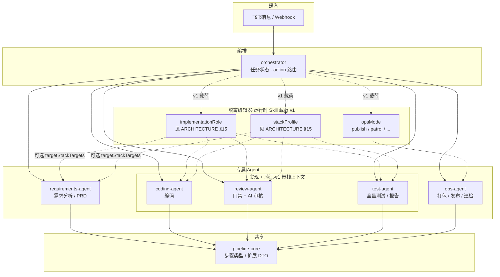

# Agents Monorepo

面向「飞书自然语言 → **需求分析** / 编码 / 审核 / 全量测试 / 发包运维」的 **通用模板骨架**（Turborepo + pnpm、共享 ESLint/TS、根配置与 `.cursor/rules`）。

## `apps/*`：1 个编排 + 5 个 Agent（共 6 个应用）

| 应用 | 职责 |
|------|------|
| **`orchestrator`** | 编排：飞书/Webhook、任务状态、调用各 Agent、汇总群内消息 |
| **`requirements-agent`** | **产品需求分析**：口头需求 → 结构化 PRD / 验收标准 / 风险 |
| **`coding-agent`** | 编码 Agent |
| **`review-agent`** | 审核 Agent：确定性门禁 + `.cursor/rules` 语义评审 |
| **`test-agent`** | 测试 Agent：执行 **全量** 测试命令、聚合报告（对接飞书由 orchestrator 转发） |
| **`ops-agent`** | 运维 Agent：打包、产物校验、发布/远端运维 |

默认端口见 **`agents.config.yaml`**（本地占位：**4010–4060**）。

## 其它路径

| 路径 | 说明 |
|------|------|
| `packages/pipeline-core` | 流水线步骤类型（含 `requirements_analysis`、`qa_full_suite`、`ops_publish`、`full_release`） |
| `packages/logger` | 结构化日志 + 加载 **monorepo 根** `.env`（`loadMonorepoEnvFromEntry`） |
| `packages/http-errors` | `AppError`、Express **统一错误中间件**、`helmet` 安全头、404 处理 |
| `packages/eslint-config`、`packages/typescript-config` | 共享工程配置 |
| `.env`（自 `.env.example` 复制，**勿提交**） | 端口、目标路径、密钥等；含 **`TASK_STORE_DRIVER`**（MVP 用 `memory`）及预留 `DATABASE_URL` / `REDIS_URL` 说明 |
| `e2e` | Playwright：并行拉起各应用的 `/health` 冒烟 |
| `agents.config.yaml` | `pipeline.fullTestCommand` / `publishCommand`、`review.aiRulesGlob` |
| `docs/FEISHU_COMMANDS.md` | 飞书侧 **指令格式与示例**（复盘） |
| `docs/CUSTOMER_GUIDE.md` | **客户导引**：首次接触时各 Agent 分工、推荐顺序；与飞书 **「帮助」**（§0）配合 |
| `docs/ARCHITECTURE.md` | **架构**：信任边界、契约、配置与状态、同步/异步、ops 拆分、**HTTP 栈（Node + Express §13）** 等 |
| `docs/IMPLEMENTATION_ROADMAP.md` | **实践顺序与工程建议**（由里到外；含首个 Agent **本周验收 Checklist** 二选一） |

持久化 AI 约定见 **`.cursor/rules/*.mdc`**。

## 命令

本地开发脚本见下表。**飞书里对用户可见的指令句子与验证码规则**见 **`docs/FEISHU_COMMANDS.md`**。

```bash
pnpm install
pnpm run dev          # Turbo 并行 dev（全部 apps）
pnpm run build
pnpm run lint
pnpm run check-types
pnpm run test
pnpm run test:coverage
pnpm run e2e
```

**编排并发（MVP）**：同一 **`action`（如 `code`）** 在任务处于 `pending` / `running` / `awaiting_confirmation` 时不允许再建同类任务；响应 **`409`**，体中有 **`feishuReplyText`** 可直接发飞书。可选 **`channelId`**（写入 `metadata.channelId`）时为 **按会话** 互斥；不传则 **全局** 同动作互斥。模拟入口：`POST /v1/mock-feishu`，body 示例：`{"text":"编码：修登录","channelId":"oc_xxx"}`。

## 项目架构

### 运行时拓扑

客户端通过 **飞书** 与 **`orchestrator`** 交互；编排层按任务调用各 **Agent**（HTTP 或队列，默认端口见 `agents.config.yaml`）。目标仓库路径、Git、流水线命令、验证码等在 **`agents.config.yaml`** 与 **`.env`** 中配置。



### 职责边界（摘要）

| 层级 | 职责 |
|------|------|
| **orchestrator** | 解析飞书指令、验证码校验、任务状态、调用下游 Agent、回写群消息 |
| **requirements-agent** | 需求结构化，**不**改业务代码 |
| **coding-agent** | 改代码 / Git 操作（与编排策略一致） |
| **review-agent** | 执行 blocking 脚本 + 基于规则的 LLM 评审 |
| **test-agent** | 在 `TARGET_WORKSPACE_PATH` 下跑 `fullTestCommand` 等并汇总报告 |
| **ops-agent** | 构建产物、远端发布、备份回滚、服务器探测（只读命令由配置约束） |
| **pipeline-core** | 跨 Agent 复用的步骤枚举与类型，避免各 app 各写一套 |

配置与密钥：**非敏感默认**放在 `agents.config.yaml`；**口令、SSH、API Key** 放在 `.env`（见 `.env.example`）。飞书用户指令示例见 **`docs/FEISHU_COMMANDS.md`**。**架构边界与演进约定**见 **`docs/ARCHITECTURE.md`**。**按步落地实现**见 **`docs/IMPLEMENTATION_ROADMAP.md`**。
