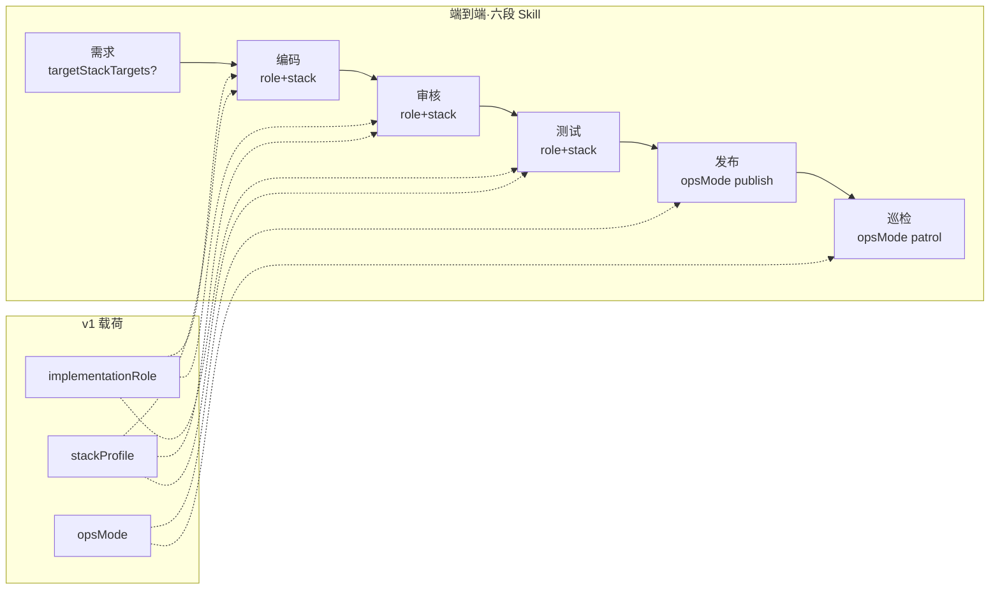

# 架构说明（边界与演进约定）

本文描述 **架构层面** 的信任边界、共享契约、配置与任务状态、同步/异步形状、可观测性、幂等，以及 **规划期易漏的风险与非功能约束**（§8–§11）；与 [FEISHU_COMMANDS.md](./FEISHU_COMMANDS.md)（人机指令）、[IMPLEMENTATION_ROADMAP.md](./IMPLEMENTATION_ROADMAP.md)（落地顺序）并列。实现细节见各 `apps/*` 与 `.cursor/rules/*.mdc`。

---

## 1. 信任边界与唯一入口

| 位置 | 职责 |
|------|------|
| **orchestrator** | 唯一 **对外边界**：飞书 / Webhook / 公网可直达的 HTTP。验签、验证码、幂等键、任务生命周期、是否允许进入某步骤（状态机）**优先落在此层**。 |
| **各 Agent** | **对内服务**：假定由受信方（本机回环、内网、或 mTLS 后的同伴）调用；契约为带 `taskId` 等的 **内部任务请求**，不重复解析飞书协议。 |

**实现时需明示**：Agent 监听地址是否仅绑定 `127.0.0.1`、是否另有内部令牌；避免将 Agent 端口误暴露到公网却未鉴权。

---

## 2. 契约层（`pipeline-core` 与扩展）

- **现状**：`@agents/pipeline-core` 提供流水线 **步骤种类**（如 `requirements_analysis`、`qa_full_suite`、`ops_publish`）等枚举。
- **演进**：orchestrator ↔ 各 Agent 的 **请求/响应模型、错误码、任务状态枚举** 应集中在 **单一事实来源**：
  - 优先在 `packages/pipeline-core` 中扩展；或
  - 另建 `packages/contracts`（若希望 core 保持「纯步骤」、DTO 体量大时再拆）。

**原则**：跨进程边界只依赖 **版本化** 的共享包；禁止 `apps/*` 互相直接 import，禁止各应用私下 duplicate 一套 DTO。

**兼容与发布**：契约或 DTO 发生 **破坏性变更** 时，应 **显式升版本**（包 semver 或契约 `version` 字段），并约定 **orchestrator 与下游 Agent 同仓/同版本部署** 或短暂 **双读兼容窗口**；避免「仅升级一侧」导致静默解析失败。

---

## 3. 配置架构（YAML + env）

| 来源 | 适用 |
|------|------|
| **`agents.config.yaml`** | 可提交的默认与非秘密项：端口、流水线命令占位、审核 profile、`feishu.*` 开关等。 |
| **`.env` / 环境变量** | 秘密、机器相关覆盖、本地路径；优先级 **env 覆盖 YAML**（与仓库注释一致）。 |

**读取策略**：

- **orchestrator**：需要 **聚合视图**（安全、飞书、下游 Agent 基址、目标工作区等）。
- **各 Agent**：理想为 **最小子集**（本服务端口、超时、`TARGET_WORKSPACE_PATH` **或单次请求体内的** `workspacePath` 字段等），避免每个 Agent 再充当全局配置中心。
- **实现落点**：共享 **`loadAgentsConfig()`**（`@agents/agents-config`）解析 `agents.config.yaml` 并经 **Zod 校验**，而非分散重复读文件。

**多客户业务仓库（可选）**：`agents.config.yaml` 可在 `target.projects` 中登记多个 `{ id, workspacePath, label? }`。**飞书链路**由 orchestrator 解析「本会话绑定 / 本条首行目标 / env 默认 id」后用 **解析得到的绝对路径** 调用编码、审核与测试 Agent（契约字段 `workspacePath`，与单机 `TARGET_WORKSPACE_PATH` 等价位）。详见 `docs/FEISHU_COMMANDS.md`。未配置 `projects` 时行为与单目标一致。

**客户业务仓前置条件**：实际执行仍以 **某一个解析后的 workspace 根** 为客户项目 cwd；须在文档或自检中约定 **Node / pnpm（或包管理器）/ 可选 Turbo 版本** 与客户仓一致，否则「模板里能跑、客户仓里挂」的漂移属于 **环境类问题**，不靠编排代码单独解决。

---

## 4. 任务与状态（编排内核）

- **职责归属**：**任务图、当前步骤、业务状态机**（例如「需求分析未完成则禁止编码」）由 **orchestrator** 持有；Agent **汇报结果**，不把全局任务真相分散到多服务。
- **演进**：
  - 早期：进程内 `Map` / 内存结构即可。
  - 后期：抽象 **TaskStore**（接口），背后换 Redis / DB，**不改变** orchestrator 对外与对 Agent 的契约形状。

**实现近况（MVP）**：`@agents/pipeline-core` 导出 **`ITaskStore` / `ITaskRecord` / `TaskStatus`**；orchestrator 默认 **`MemoryTaskStore`**，环境变量 **`TASK_STORE_DRIVER=memory`**。**同 `action` 并发**：创建任务前调用 **`findActiveTaskByAction`**（见 `IFindActiveTaskQuery`），冲突时 **`409`** + **`feishuReplyText`**，避免飞书侧重复「编码」等。后续可新增 **`PostgresTaskStore`**（Prisma + 任务表）、**向量检索**（pgvector 等）作为 **独立模块**，与 TaskStore **正交**（检索不替代任务持久化）。**Redis / Bull** 用于队列与分布式锁时，再按需接入；orch 对外路由与 `ITaskStore` 签名保持不变。

**需求（PRD）与编码的语义**：在状态机中显式区分 **需求产物「草稿」** 与 **「已确认 / 可实施」**（命名以契约枚举为准），避免未对齐口径即进入 `coding`。**谁在什么动作下完成确认**（飞书指令、确认回调或 orchestrator 固定规则）应在产品上定死，减少与需求 Agent 输出之间的扯皮。

**群内分步确认（可选）**：当 `feishu.confirmBetweenPipelineSteps: true`（见 `agents.config.yaml`）时，每个主要子步骤结束后由 orchestrator **向群推送摘要**，并等待用户 **`workflow_continue` / `workflow_pause` 类** 回复再推进（话术见 [FEISHU_COMMANDS.md](./FEISHU_COMMANDS.md) §14）。任务状态须能表示 **`pending_confirmation`** 与 **已完成子步骤**，并与 `taskId`、幂等键协同，避免 Webhook 重试导致 **重复推进或跳过确认**。

**组合流水线**：内部动作 **`full_release`** 表示 **全量测试 → 打包（构建）→ 发包**，顺序绑定 `pipeline.fullTestCommand`、`pipeline.publishCommand`（或等价 build）及既有 ops 发布路径；须 **验证码**，且整体应按 **§5（同步 HTTP 与异步执行）** **异步执行**，分步确认打开时在测试后、构建后、**最终发包前** 等边界停顿（见 [FEISHU_COMMANDS.md](./FEISHU_COMMANDS.md) §14–§15）。

---

## 5. 同步 HTTP 与异步执行

| 形态 | 适用 |
|------|------|
| **同步请求–响应** | 短路径：需求摘要触发、单次审核触发等（受网关超时约束）。 |
| **异步** | 长耗时：全量测试套件、发布/滚动。HTTP 可仅表示 **接纳任务**（入队）；执行在 **worker / 子进程**，通过 **状态查询或回调** 汇报 completion。 |

不必首日引入消息队列，但 **orchestrator** 侧建议按 `.cursor/rules/orchestrator-app.mdc` 为 **`workers` / 长任务** 预留模块边界，避免长逻辑堆在单个 HTTP handler 里。

**网关与客户端**：对外 HTTP **不得依赖「单请求直到全量测/发布跑完」**；否则易出现 **网关超时** 与 **客户端重试导致双跑**（与幂等设计联动）。接纳请求与 **实际执行完成** 应能在架构上拆开。

**容量与背压**：为子进程 / Worker 设 **全局并发上限**、单任务 **超时** 与 **队列或拒绝策略**，避免弱 Runner 上 **OOM 或拖死** 整台编排机（具体阈值由部署环境配置）。

---

## 6. 可观测性（关联 ID）

- **约定**：`taskId` 由 orchestrator 生成（或与飞书侧 id 可逆映射），并 **贯穿** 日志与对下游的调用（HTTP header 或 body 字段任选其一为固定规范）。
- **可选**：`traceId` / OpenTelemetry 等与 `taskId` 并列；日志字段建议至少包含 `taskId`、`action`、**截断后的** `workspacePath`、下游 Agent 名与耗时。

**日志与合规（原则）**：飞书正文、用户标识、完整路径可能含 **PII**；架构上应约定 **默认脱敏或截断**、**保留周期**、以及是否与第三方日志平台同步——满足内审或辖区合规时再细化策略。

---

## 7. 幂等与重试

- **假设**：飞书/Webhook 可能 **至少投递一次**；编排层应设计 **任务级幂等** 或「同一任务的破坏性操作只提交一次」。
- **引用回复（需求修订）**：编排可解析 IM 消息中的 **`parent_id` / `root_id`**，并与 **机器人成功发出的 PRD `message_id`** 在进程内建立 **临时锚点**，将用户补充 **合并进既有** `requirements_analysis` 任务（与「同一次 Webhook 重复投递」的去重策略正交）；细节见 [FEISHU_COMMANDS.md](./FEISHU_COMMANDS.md) **第 4、12 节**。
- **落点**：幂等键、去重窗口、**发布/回滚/改配** 等关键操作应在 **orchestrator**（或其后继 TaskStore）统一策略，而非每个 Agent 各自防重。

---

## 8. 人机指令与内部动作的一致性

- [FEISHU_COMMANDS.md](./FEISHU_COMMANDS.md) 描述 **用户可见** 的句子与示例。
- **内部**须映射到稳定 **`action` / `PipelineStepKind` / 契约枚举**，与 `pipeline-core` 保持一致，避免「文档一套名字、代码另一套」长期分叉。

**同步约束**：飞书侧文案、**意图路由表**、**状态机允许的下一步** 三者应同事务变更；推荐 **更新 FEISHU 文档时顺带更新路由/映射或契约单测**，减少群里说法与系统拒答理由不一致的运维纠纷。

---

## 9. 安全与输入（HTTP + 工作区）

- 新增或扩展 **对外 HTTP** 时，在统一入口配置常见安全响应头（如 `X-Content-Type-Options`、`Referrer-Policy` 等），与部署方式一致；敏感接口限流与鉴权。详见仓库 `.cursor/rules/security-coding.mdc`。

**不可信输入**：从消息或查询中解析的 **工作区路径、分支名、自定义命令片段** 等，在写入 shell 或 `exec` 前须 **校验与白名单化**（解析为真实路径、禁止 `..` 逃逸、禁止拼接未转义片段），优先 **参数数组** 调用子进程，避免 **命令注入**。

**静态验证码**：适合小范围 PoC；群可见性高时存在 **转发泄露** 风险；增强方案（私聊校验、轮换）见 [FEISHU_COMMANDS.md](./FEISHU_COMMANDS.md) 与实现时的 `security.verificationCode` 约定。

---

## 10. 质量与工程一致

- **CI 与 Agent**：`review-agent` / `test-agent` 执行的 **lint / typecheck / fullTest** 等应与 **CI 真源**一致（同源配置：`agents.config.yaml` 的 `pipeline` / `review`、或仓库内单一脚本入口）。避免「Agent 通过、流水线挂」或反向漂移。
- **LLM 路径**（需求 / 评审）：约定 **超时、重试上限、输出结构校验**（如 JSON schema 或必选 Markdown 小节），并设 **成本与配额上限**（按部署可配置）；避免无界重试与不可解析输出进入下游。
- **评审可复盘**：LLM 或规则评审应能附带 **可引用证据**（规则文件条目、diff 范围摘要等），不仅输出结论短语，便于事后审计与拒绝申诉。

---

## 11. 运维与演化

- **配置 ≠ 已验证**：`backup` / `rollback` / `publish` 仅在 YAML 中存在不等于可恢复；架构上应安排 **周期性演练**（备份成功、回滚到上一版本在目标环境可执行）。
- **文档与代码**：规则与架构说明会慢于代码；用 **关键路径自动化**（健康检查、模拟飞书到单 Agent、契约单测）比单靠人工同步文档更能防止漂移。

---

## 12. ops-agent：职责边界与可选拆分

当前设计把 **与工作区构建、产物校验、远端发放（rsync 等）、备份/回滚、只读巡检** 放在同一 **`ops-agent`**，由 orchestrator 按步骤触发（参见 `.cursor/rules/ops-agent-app.mdc`）。

**默认建议：不拆成多个独立 Agent 进程**，在同一应用内用 **子模块** 区分即可（例如 `packaging/`、`deploy/`、`probe/`、`backup/`），共享配置加载与日志，降低编排面复杂度。

**可考虑拆进程（或拆部署单元）的典型条件**：

| 条件 | 说明 |
|------|------|
| **权限与网络域不同** | 巡检仅需 **只读** SSH，发布需要写目录与重启；若安全策略要求 **不同密钥、不同跳板或不同 VPC**，可拆 **probe** 为独立服务或使用单独只读账号（仍可在同一 repo 两个 app，或同进程两套 client）。 |
| **构建与发放分离** | 产物在 **CI 构建** 后只下发 artifact；运行侧 **不再在目标机执行 build**。此时「本地打包」可由 orchestrator 调 shell/CI 产物，`ops-agent` 收窄为 **发放 + 健康检查 + 回滚**。这是 **职责收窄**，未必新增第二个 Agent。 |
| **扩缩与隔离** | 巡检高频、发布低频且资源争抢；或希望发布服务挂掉时 **巡检/只读健康检查仍可用**（较少见，可用队列与超时区分优先）。 |

**与 `full_release` 的关系**：一键流水线中的 **测试** 偏 `test-agent`，**打包** 常与 `pipeline.publishCommand` 在 **目标工作区** 执行，**上传与重启** 偏 `ops-agent`；若你希望「打包」永远在 CI，只需在契约里写明由谁执行，**不必**为 nomenclature 再拆第三个 Agent。

---

## 13. HTTP 服务技术栈（Node + Express）

各 **`apps/*`** 中对外提供 HTTP 的服务（**`orchestrator`** 与各 **Agent**）**默认采用 Node.js + Express** 实现路由、中间件与错误处理；与现有 **ESM（`"type": "module"`）**、**TypeScript** 一致。

**建议一致性**：

| 项 | 说明 |
|------|------|
| **入口** | `src/index.ts` 创建 Express `app`，监听端口仍由 env / `agents.config.yaml` 决定。 |
| **分层** | 与 [orchestrator-app.mdc](../.cursor/rules/orchestrator-app.mdc) 一致：`routes` → handlers/controllers → `services` → `clients`；长任务不接在同步请求里完结。 |
| **安全头** | 在 **统一入口** 挂载安全相关中间件（如 **`helmet`** 或等价响应头），与 `.cursor/rules/security-coding.mdc` 对齐；对外路由限流、体大小上限按需加。 |
| **解析与校验** | JSON body 解析 + **Zod**（或同类）在 **handler 边界**校验；错误映射为稳定 JSON，**不**回堆栈给客户端。 |
| **下游调用** | 对其它 Agent 使用 **带超时的 HTTP 客户端**（如 `fetch` + `AbortController`），`taskId` 经 header 或 body 贯穿。 |

**说明**：若个别 Agent 长期仅为极简 health，可暂缓引入 Express；**编排与飞书入口**应优先 Express，便于中间件与路由表演进。替换为 Fastify 等属同级别方案，需同步更新本文与规则。

---

## 14. 相关文档

| 文档 | 内容 |
|------|------|
| [IMPLEMENTATION_ROADMAP.md](./IMPLEMENTATION_ROADMAP.md) | 由里到外的 **实现顺序** 与首个 Agent 验收 Checklist |
| [FEISHU_COMMANDS.md](./FEISHU_COMMANDS.md) | 飞书指令格式与验证码（含 **§0 帮助 / `help`**） |
| [CUSTOMER_GUIDE.md](./CUSTOMER_GUIDE.md) | 客户侧 **首次接触导引**（与群内「帮助」文案互补） |
| `README.md` | 拓扑图与命令入口 |
| `.cursor/rules/orchestrator-app.mdc` 等 | 各 app 分层与目录习惯 |
| `.cursor/rules/ops-agent-app.mdc` | ops-agent 职责与安全 |

---

## 15. 运行时 Skill 划分（v1）

本节是 **脱离 Cursor、由编排调度** 的一版完整约定：**六段流水线各自对应一个 Skill 域**（仍为同一批 Agent 进程）；差异体现在 **任务载荷**（建议收敛进 `pipeline-core` DTO），而非首日拆更多 HTTP 服务。

### 15.1 六段 Skill 域与 v1 载荷

| Skill 域（阶段） | 主要进程 | v1 载荷要点 |
|------------------|----------|-------------|
| **需求分析** | `requirements-agent` | 可选 **`targetStackTargets`**：`{ implementationRole, stackProfile }[]`，用于 PRD/验收对齐多面前端或前后端 |
| **编码** | `coding-agent` | **必选**（当进入实现类 action）：`implementationRole` + `stackProfile`（枚举见 15.4） |
| **审核** | `review-agent` | 与 **编码** **同链路同源**：同一组 `implementationRole` + `stackProfile` |
| **测试** | `test-agent` | v1 **携带与实现一致**的 `implementationRole` + `stackProfile`，用于报告维度、可选的按面用例说明；**执行命令**仍以 `agents.config.yaml` 的 `pipeline.fullTestCommand` 等为真源，由客户仓吸收栈差异 |
| **发布** | `ops-agent` | **`opsMode: publish`**（或等价枚举）；具体 build/发放脚本仍由配置驱动 |
| **巡检** | `ops-agent` | **`opsMode: patrol`**；与发布 **权限与频率** 隔离（参见 §12） |

### 15.2 通用字段

| 字段 | 说明 |
|------|------|
| **`implementationRole`** | `frontend` · `backend` · `fullstack`。**`fullstack`** 时编排器可对同一需求 **顺序或并行** 下发多条实现子链（各带子 `stackProfile`），或在契约中约定「主链 + 附链」；v1 文档以 **每条载荷单一 role** 为准。 |
| **`stackProfile`** | 与 `implementationRole` 组合的 **封闭枚举**（15.4）；未在表内的取值应 **拒绝** 或 **显式降级策略**（人工/默认 profile），并记录审计。 |
| **`opsMode`** | `publish` · `patrol` ·（可选）`backup` · `rollback`；与飞书 `action` / `PipelineStepKind` 的映射须单一事实来源，避免文案与内部枚举分叉（对齐 §8）。 |

**一致性**：`coding-agent` → `review-agent` → `test-agent` 在 **同一实现任务** 上应传递 **相同的 `implementationRole` + `stackProfile`**（`fullstack` 多子链时各自一条）。

### 15.3 `targetStackTargets`（需求侧，可选）

用于需求产物中声明「本需求涉及的面与栈」，供编排与下游选人/选提示词模板；**不改变**「一个需求 Agent」的进程边界。

示例形状（概念）：`[{ "implementationRole": "frontend", "stackProfile": "nuxt-3" }, { "implementationRole": "backend", "stackProfile": "node-nest" }]`。

### 15.4 `stackProfile` 枚举（v1）

扩展时 **追加行** 并 **升契约/配置版本**。

| `implementationRole` | `stackProfile` | 说明 |
|----------------------|----------------|------|
| `frontend` | `next-app-router` | Next.js App Router |
| `frontend` | `next-pages` | Next.js Pages Router |
| `frontend` | `react-spa` | React + Vite/类 SPA |
| `frontend` | `vue-spa-vite` | Vue 3 + Vite SPA |
| `frontend` | `nuxt-3` | Nuxt 3（SSR/SSG/约定式目录） |
| `backend` | `node-nest` | Node.js + Nest |
| `backend` | `node-express-fastify` | Express / Fastify 等轻量 API |
| `backend` | `go-gin` | Go + Gin（或同类路由栈） |

### 15.5 架构图（v1 逻辑视图）

---

*架构随实现迭代可修订本文；重大边界变更建议同步契约版本与 Release Note。§8–§11 对应前述风险域在规划期的纳入约定；§12 为 ops-agent 拆分策略；§13 为 HTTP 技术栈；**§15 为脱离编辑器的运行时 Skill v1 划分**。实现时可逐条对照验收。*
