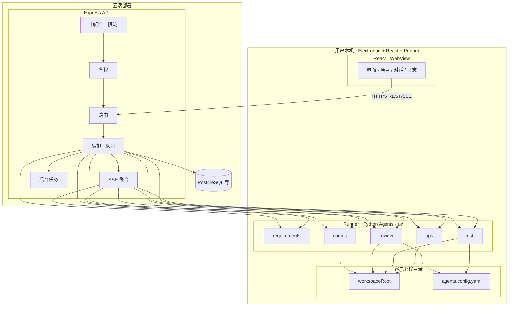
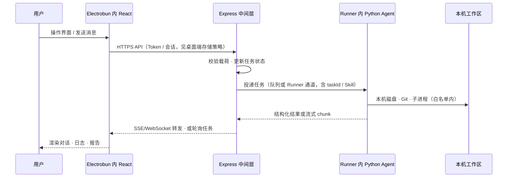
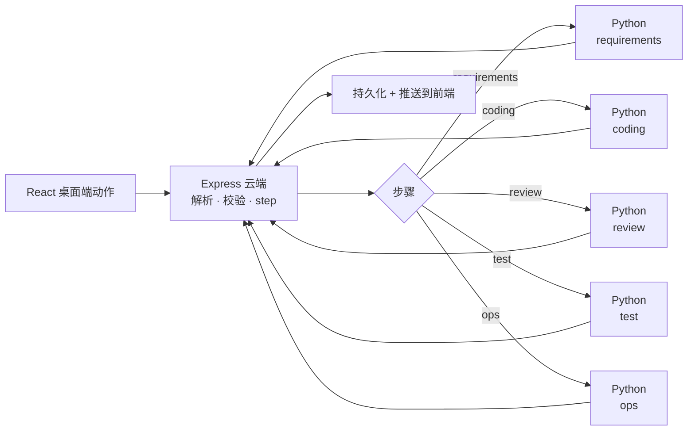

# 架构图与端到端流程

## 总体架构图（逻辑视图）

**图示**：`reactui` 与 `agentsLayer` 同属 **本机**；Express 仅在 **云端** 编排并入队，**任务执行与磁盘 IO** 只在 Runner 内完成；`workspaceRoot` **永不** 挂载到业务 VPS。

## 端到端功能流程图（主流水线）

步骤型流水线（与具体 UI 无关的逻辑）可概括为：

← [返回文档索引](./README.md)
