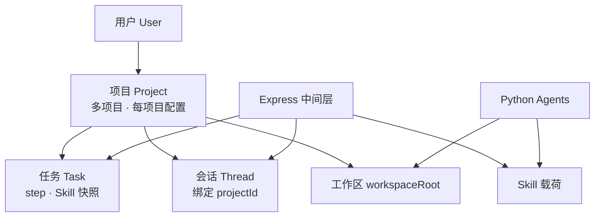

# 数据与控制（概念图）

用户 → 多项目 → 每项目独立工作区与配置；任务与会话建议均带 **`projectId`**，与日志字段 `userId` / `taskId` 一并贯穿（见 [清晰日志](./logging.md)）。

```mermaid
flowchart TB
  USER["用户 User"]
  PROJ["项目 Project<br/>多项目 · 每项目配置"]
  TASK["任务 Task<br/>step · Skill 快照"]
  SESS["会话 Thread<br/>绑定 projectId"]
  SK["Skill 载荷"]
  WS["工作区 workspaceRoot"]
  SRV["Express 中间层"]
  AGT["Python Agents"]
  USER --> PROJ
  PROJ --> TASK
  PROJ --> SESS
  PROJ --> WS
  SRV --> TASK
  SRV --> SESS
  SRV --> SK
  AGT --> SK
  AGT --> WS
```

← [返回文档索引](./README.md)
