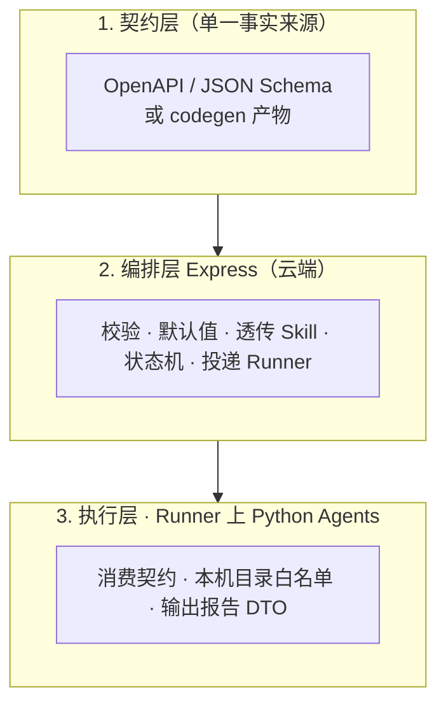

# 运行时 Skill 分层（跨语言）

**Skill**：编排时注入的任务上下文（例如实现角色、栈画像、运维模式、目标栈等），**不是** Cursor 里的 `SKILL.md`。

**原则**：新增字段时先改契约；Express 负责校验与下发；Python 只认契约中的类型，避免硬编码散落字符串。

（与 Cursor 规则 **`runtime-skills-layering.mdc`**、若存在的 `packages/pipeline-core` 对齐。）

← [返回文档索引](./README.md)
